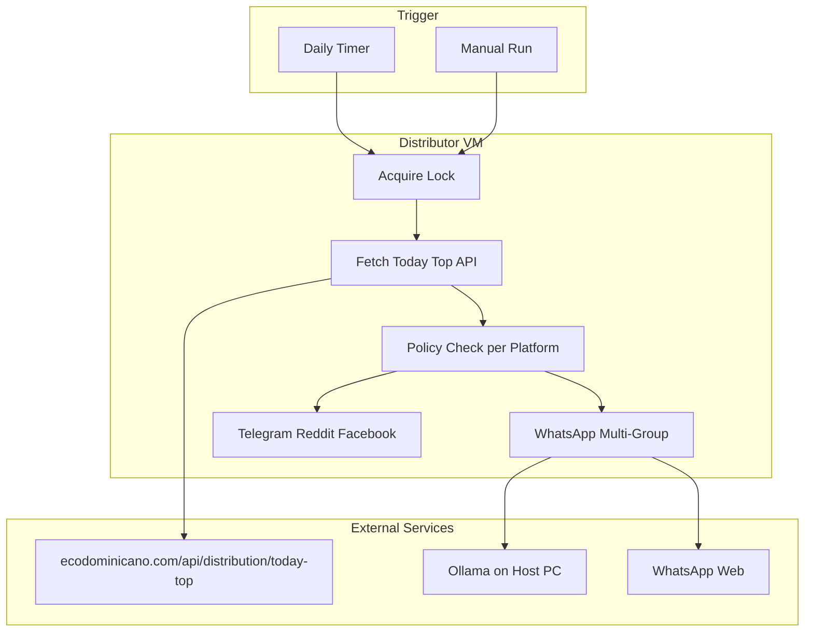
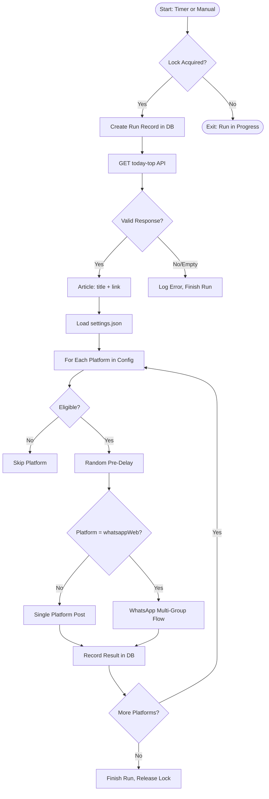
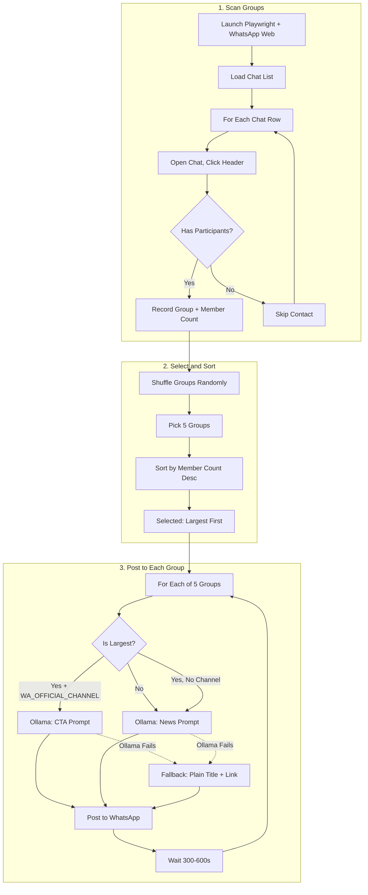
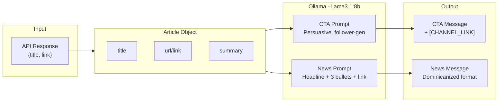
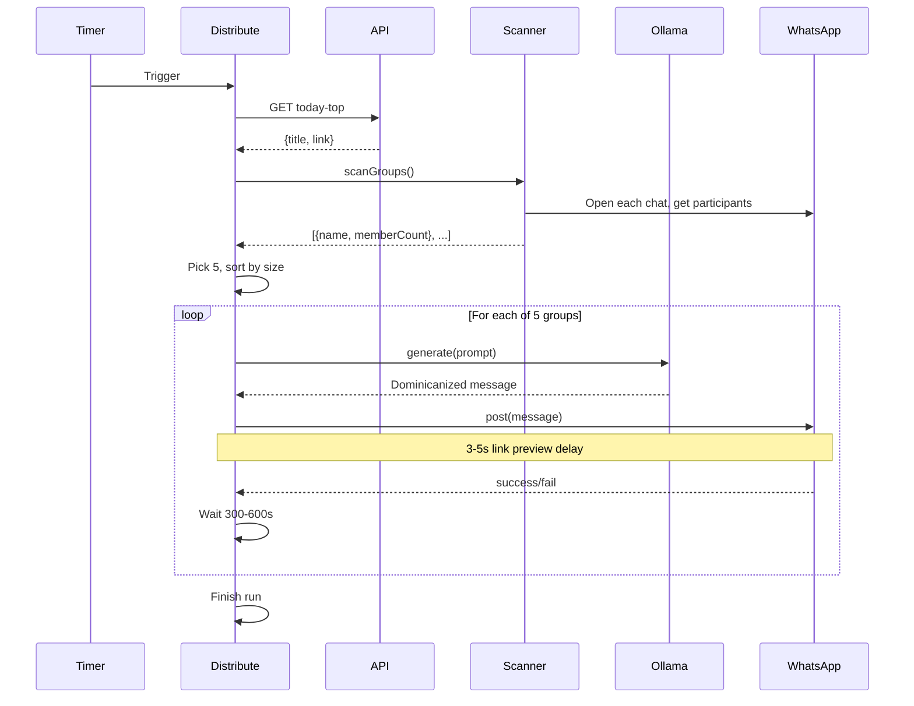

# EcoDominicano Distributor — Workflow Diagram

## High-Level Overview

---

## Detailed Flow: Full Run

---

## WhatsApp Multi-Group Flow (Detailed)

---

## Data Flow: Article to Message

---

## Timing Diagram

---

## Environment & Config Summary

| Component | Config | Purpose |
|-----------|--------|---------|
| Article source | `TODAY_TOP_URL` | API endpoint for daily article |
| Ollama | `OLLAMA_URL`, `OLLAMA_MODEL` | Host LLM for rewriting |
| WhatsApp | `WA_OFFICIAL_CHANNEL` | Channel link for CTA |
| WhatsApp | `WA_GROUP_BLOCKLIST` | Groups to exclude |
| Delays | `WA_LINK_PREVIEW_MIN/MAX` | 3-5s after pasting link |
| Delays | `WA_INTER_MESSAGE_DELAY_MIN/MAX` | 300-600s between groups |
